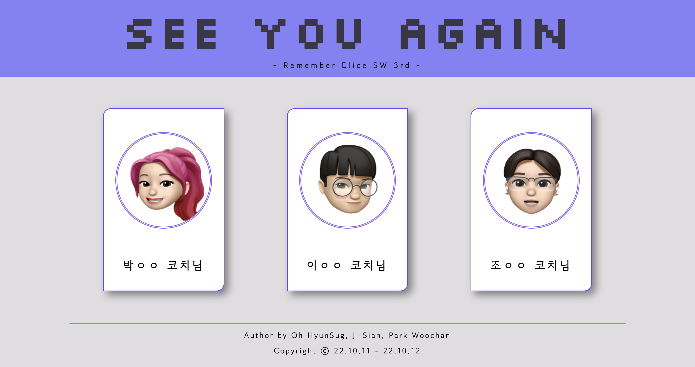
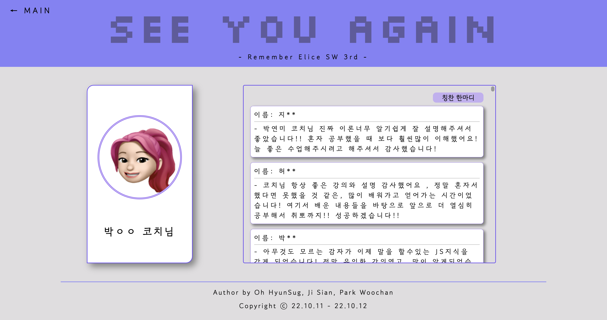
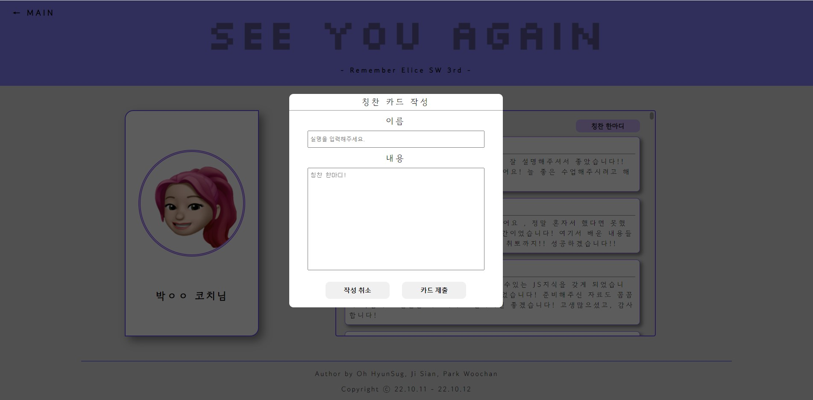
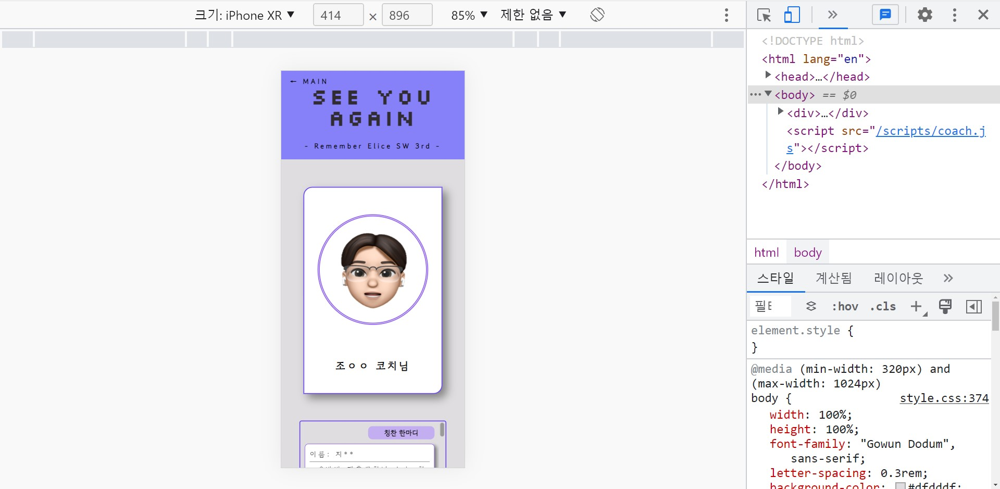

  <h1>Rolling-paper</h1>
  
  
  
  

<!-- bedge -->

 
<strong>🛠 Use Stack 🛠</strong> 
 
  
  
  
  
  
  
  
  
    
  <b>Rolling-paper</b>를 <b>반응형 WEB</b>으로 구현한 프로젝트

## 목차
- 프로젝트 소개
- 구현 기능

  

프로젝트 소개
---
Elice SW 3기를 진행하면서 1~5주간 함께 했던 코치님들께 감사인사를 전달드리는 방법을 고민하던 중 롤링페이퍼를 떠올렸고, 현실적으로 모든 레이서가 모이기 힘든 상황을 고려하여 롤링페이퍼 웹페이지를 제작하였습니다.
 
기간: 2022.10.11 ~ 2022.10.13(26H)
 

### Contributors
\- <a href="https://github.com/Croossh">박우찬</a>: 프론트 
\- <a href="https://github.com/LucetTin5">오현석</a>: 프론트, 서버 
\- <a href="https://github.com/SIYEA0405">지시안</a>: 백, 서버 

구현 기능
---
- 글 작성(각 코치별 한마디 남기기)
- 본인 및 다른 사용자들이 남긴 모든 글 조회(각 코치별 모든 한마디 조회)
- 반응형 웹
 
